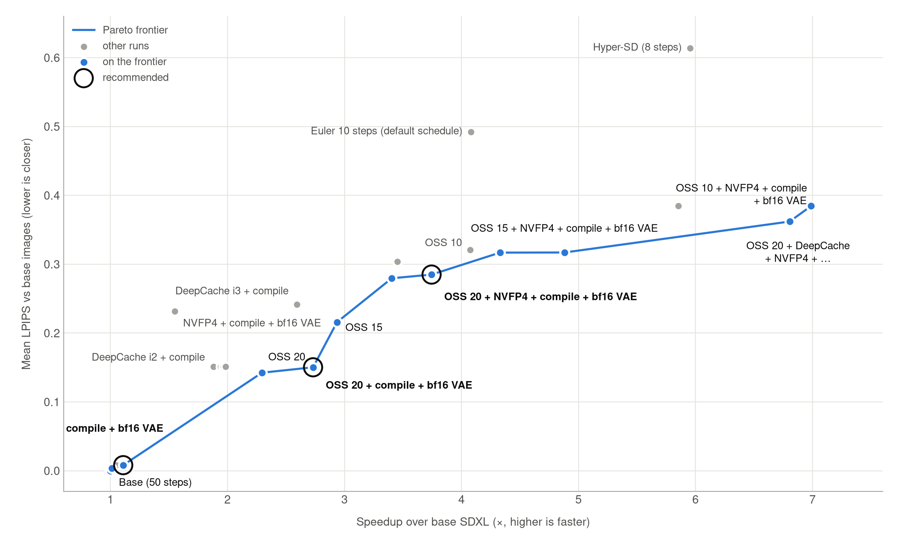

# sdxl-optimization

Optimizations of SDXL base 1.0 (fp16), each compared against the unoptimized base model.

Left: the fastest recommended configuration (`optimal_steps_20_nvfp4_torch_compile_vae_bf16_no_watermark`).
Right: base SDXL. Each image appears when it finished generating in the timed run. Click for the
[MP4](speed_comparison.mp4); `src/make_speed_video.py` regenerates it.

**Setup for all results:** 50 prompts from `playgroundai/MJHQ-30K` (5 per category, seed 0), generation
seed 0, 50 steps, 1024×1024, on an RTX 5080 (nc-11-3-3). Reference images and timings are in
`references/sdxl_base/`. Timings are wall-clock per image after a warm-up run, including the GPU
synchronization after each timed component. Each run's images, 4×4 grid and full record are in `runs/`.

Run a variant with `uv run python src/evaluate.py <variant>`; the variants are defined in `src/evaluate.py`.
`optimal_steps_10` needs its schedule from `src/search_optimal_steps.py` first (already in `schedules/`).

Metrics compare each image to the base model's image for the same prompt: LPIPS and DreamSim (lower =
closer), PSNR in dB (higher = closer). They measure similarity to the base output, not image quality.

## Overview: speed vs fidelity

Every run as speedup over the base model against mean LPIPS; the blue line is the Pareto frontier (runs no other
run beats on both axes). The circled runs are the recommended configurations:

| configuration | variant | ms per image | speedup | mean LPIPS | mean DreamSim |
|---|---|---:|---:|---:|---:|
| compile + bf16 VAE (near-identical to base) | `torch_compile_vae_bf16` | 7287 | 1.11x | 0.008 | 0.0005 |
| OSS 20 + compile + bf16 VAE, no watermark (fast, close to base) | `optimal_steps_20_torch_compile_vae_bf16_no_watermark` | 2958 | 2.73x | 0.150 | 0.022 |
| OSS 20 + NVFP4 + compile + bf16 VAE, no watermark (fastest recommended) | `optimal_steps_20_nvfp4_torch_compile_vae_bf16_no_watermark` | 2158 | 3.74x | 0.285 | 0.083 |

Redraw the chart after new runs with `uv run --with matplotlib python src/plot_pareto.py`.

## Base (no optimizations)

`SDXLBase`, variant `base`. Run: `runs/20260915_142608_base/`.

| component, mean per image | ms |
|---|---:|
| text_encoder (CLIP ViT-L) | 2.3 |
| text_encoder_2 (OpenCLIP ViT-bigG) | 4.6 |
| U-Net, all 50 steps | 7651.3 |
| U-Net step (median) | 152.6 |
| VAE decode | 352.2 |
| other (tokenization, scheduler, postprocessing) | 70.4 |
| **total** | **8080.9** |

Regenerating the base model against its own reference gives 50/50 pixel-identical images and a total
time within 0.03% of the reference (8078.5 ms), so generation is deterministic and the timings repeat.
Any metric difference in the sections below comes from the optimization.

## torch.compile (pruna, default settings)

`SDXLPruna(["torch_compile"])`, variant `torch_compile`: inductor backend, mode `default`,
`fullgraph=False`, applied to `unet.forward`. Run: `runs/20260915_143325_torch_compile/`.

| metric | mean | std | min | max |
|---|---:|---:|---:|---:|
| LPIPS | 0.0082 | 0.0127 | 0.0016 | 0.0710 |
| DreamSim | 0.0007 | 0.0018 | 0.0000 | 0.0113 |
| PSNR dB | 41.06 | 4.20 | 29.66 | 48.40 |

| mean per image (ms) | base | torch.compile | speedup |
|---|---:|---:|---:|
| U-Net, all steps | 7649.4 | 7253.4 | 1.05x |
| U-Net step (median) | 152.5 | 144.7 | 1.05x |
| VAE decode | 352.1 | 352.9 | 1.00x |
| **total** | **8078.5** | **7685.2** | **1.05x** |

The speedup is entirely in the U-Net (the VAE decoder is not compiled). No pair is pixel-identical
because compiled kernels round fp16 math differently, but all pairs stay very close (min PSNR 29.7 dB,
max LPIPS 0.07).

## DeepCache + torch.compile (pruna, default settings)

`SDXLPruna(["deepcache", "torch_compile"])`, variant `deepcache_torch_compile`: DeepCache with
interval 2 (every other U-Net step runs only the shallow blocks and reuses cached deep features), plus
torch.compile as above. Run: `runs/20260915_144030_deepcache_torch_compile/`.

| metric | mean | std | min | max |
|---|---:|---:|---:|---:|
| LPIPS | 0.1512 | 0.0944 | 0.0605 | 0.5875 |
| DreamSim | 0.0342 | 0.0446 | 0.0042 | 0.2910 |
| PSNR dB | 25.12 | 3.90 | 16.08 | 33.01 |

| mean per image (ms) | base | DeepCache + torch.compile | speedup |
|---|---:|---:|---:|
| U-Net, all steps | 7649.4 | 3866.4 | 1.98x |
| VAE decode | 352.1 | 353.0 | 1.00x |
| **total** | **8078.5** | **4299.4** | **1.88x** |

The U-Net takes about half the time. The median single-step time (149.2 ms) is not meaningful here,
since it mixes full and cached steps. The VAE decode and text encoders are unchanged, which limits the
total speedup to 1.88x. Fidelity to the base drops clearly: mean LPIPS is about 18x higher than
torch.compile alone, and the worst pair (LPIPS 0.59, DreamSim 0.29, PSNR 16.1 dB) is likely a
different image. Compare `grid.jpg` with `references/sdxl_base/grid.jpg`.

## DeepCache + torch.compile, mode max-autotune-no-cudagraphs

`SDXLPruna({"deepcache": True, "torch_compile": True, "torch_compile_mode": "max-autotune-no-cudagraphs"})`,
variant `deepcache_torch_compile_max_autotune_no_cudagraphs`: DeepCache interval 2, inductor with Triton
kernel autotuning. Run: `runs/20260915_150342_deepcache_torch_compile_max_autotune_no_cudagraphs/`.

| metric | mean | std | min | max |
|---|---:|---:|---:|---:|
| LPIPS | 0.1513 | 0.0945 | 0.0603 | 0.5879 |
| DreamSim | 0.0345 | 0.0450 | 0.0041 | 0.2921 |
| PSNR dB | 25.12 | 3.90 | 16.07 | 33.00 |

| mean per image (ms) | base | DeepCache + compile (default) | DeepCache + compile (max-autotune-no-cudagraphs) | speedup vs base |
|---|---:|---:|---:|---:|
| U-Net, all steps | 7649.4 | 3866.4 | 3724.6 | 2.05x |
| VAE decode | 352.1 | 353.0 | 352.7 | 1.00x |
| **total** | **8078.5** | **4299.4** | **4157.5** | **1.94x** |

Autotuning saves another 142 ms per image (3.4%) over the `default` compile mode, with the same fidelity
(the metrics match the `default` run to within noise).

**Modes with CUDA graphs don't work with DeepCache.** `max-autotune` failed during warm-up with
`accessing tensor output of CUDAGraphs that has been overwritten by a subsequent run`: DeepCache keeps
the deep features of a full step to reuse in the next steps, but CUDA graphs reuse their output memory,
so the next graph run overwrites them. `reduce-overhead` and the `cudagraphs` backend use CUDA graphs
the same way. Of pruna's other backends, `onnxrt`, `tvm` and `openxla` are not installed and `openvino`
targets CPUs, so `inductor` is the only usable backend here.

## DeepCache interval 3 + torch.compile

`SDXLPruna({"deepcache": True, "deepcache_interval": 3, "torch_compile": True})`, variant
`deepcache_interval3_torch_compile`: two out of every three U-Net steps reuse cached deep features;
torch.compile in `default` mode. Run: `runs/20260915_150024_deepcache_interval3_torch_compile/`.

| metric | mean | std | min | max |
|---|---:|---:|---:|---:|
| LPIPS | 0.2414 | 0.1035 | 0.1056 | 0.5944 |
| DreamSim | 0.0668 | 0.0553 | 0.0100 | 0.2863 |
| PSNR dB | 22.03 | 3.36 | 15.10 | 29.09 |

| mean per image (ms) | base | DeepCache interval 2 | DeepCache interval 3 | speedup vs base |
|---|---:|---:|---:|---:|
| U-Net, all steps | 7649.4 | 3866.4 | 2687.3 | 2.85x |
| VAE decode | 352.1 | 353.0 | 352.4 | 1.00x |
| **total** | **8078.5** | **4299.4** | **3114.7** | **2.59x** |

A cached step costs about 4 ms (the median step is 4.2 ms, since two thirds of the steps are cached),
against about 150 ms for a full step. Compared with interval 2, mean LPIPS rises from 0.15 to 0.24 and
mean DreamSim roughly doubles (0.034 to 0.067). The VAE decode (352 ms) is now 11% of the total and is
not compiled by pruna: plain `torch_compile` only compiles `unet.forward`, and with DeepCache pruna
compiles the VAE module, which covers its `forward` but not the `vae.decode` method the pipeline calls.

## DeepCache + torch.compile (max-autotune-no-cudagraphs) + compiled VAE decode

`SDXLPrunaCompiledVAE({"deepcache": True, "torch_compile": True, "torch_compile_mode":
"max-autotune-no-cudagraphs"}, vae_compile_mode="max-autotune-no-cudagraphs")`, variant
`deepcache_torch_compile_max_autotune_no_cudagraphs_vae`: the best interval-2 configuration, plus
`torch.compile` on `pipe.vae.decode`. Run: `runs/20260915_161345_deepcache_torch_compile_max_autotune_no_cudagraphs_vae/`.

| metric | mean | std | min | max |
|---|---:|---:|---:|---:|
| LPIPS | 0.1513 | 0.0943 | 0.0602 | 0.5881 |
| DreamSim | 0.0344 | 0.0448 | 0.0041 | 0.2913 |
| PSNR dB | 25.12 | 3.89 | 16.08 | 32.95 |

| mean per image (ms) | base | without VAE compile | with VAE compile | speedup vs base |
|---|---:|---:|---:|---:|
| U-Net, all steps | 7649.4 | 3724.6 | 3725.7 | 2.05x |
| VAE decode | 352.1 | 352.7 | 300.7 | 1.17x |
| other | 70.1 | 73.7 | 80.4 | 0.87x |
| **total** | **8078.5** | **4157.5** | **4113.7** | **1.96x** |

Compiling the decode takes 52 ms (15%) off the VAE, but "other" grows by 7 ms, so the total improves by
44 ms (1.1%). The metrics are unchanged. The pipeline upcasts the VAE to float32 before each decode and
back to fp16 after; this did not cause recompiles (all recompiles in the log happen during warm-up).

## + QKV fusion (qkv_diffusers)

`SDXLPrunaCompiledVAE({"deepcache": True, "qkv_diffusers": True, "torch_compile": True,
"torch_compile_mode": "max-autotune-no-cudagraphs"}, vae_compile_mode="max-autotune-no-cudagraphs")`,
variant `deepcache_qkv_torch_compile_max_autotune_no_cudagraphs_vae`: the previous configuration plus
pruna's `qkv_diffusers`, which calls `fuse_qkv_projections()` on the U-Net so each attention layer
computes query, key and value with one matrix multiply instead of three. Run:
`runs/20260915_163716_deepcache_qkv_torch_compile_max_autotune_no_cudagraphs_vae/`.

| metric | mean | std | min | max |
|---|---:|---:|---:|---:|
| LPIPS | 0.1511 | 0.0943 | 0.0602 | 0.5882 |
| DreamSim | 0.0343 | 0.0448 | 0.0041 | 0.2918 |
| PSNR dB | 25.12 | 3.89 | 16.08 | 32.96 |

| mean per image (ms) | base | without QKV fusion | with QKV fusion | speedup vs base |
|---|---:|---:|---:|---:|
| U-Net, all steps | 7649.4 | 3725.7 | 3710.0 | 2.06x |
| VAE decode | 352.1 | 300.7 | 281.5 | 1.25x |
| other | 70.1 | 80.4 | 71.6 | 0.98x |
| **total** | **8078.5** | **4113.7** | **4069.5** | **1.99x** |

QKV fusion itself changes little: the U-Net is 16 ms (0.4%) faster. Most of the 44 ms total gain is in
the VAE decode and "other", which QKV fusion does not touch (pruna applies it to the U-Net only). That
part is run-to-run variation, likely from `max-autotune` selecting different kernels for the VAE in
each run, so treat differences of a few tens of milliseconds between compiled runs as noise.

`padding_pruning` was not run: pruna only applies it to pipelines with a `max_sequence_length` argument
(T5-based pipelines such as Flux or SD3). SDXL's CLIP encoders use a fixed 77 tokens.

## Hyper-SD (pruna hyper, alone)

`SDXLPruna(["hyper"])`, variant `hyper`: pruna loads ByteDance's `Hyper-SDXL-8steps-lora.safetensors`
LoRA, switches to the TCD scheduler, and makes the pipeline default to 8 steps with `guidance_scale=0`
(no classifier-free guidance, so the U-Net processes a batch of 1 instead of 2). No other optimizations.
Run: `runs/20260915_164230_hyper/`.

| metric | mean | std | min | max |
|---|---:|---:|---:|---:|
| LPIPS | 0.6138 | 0.0862 | 0.4741 | 0.8044 |
| DreamSim | 0.2259 | 0.1050 | 0.1036 | 0.5534 |
| PSNR dB | 13.32 | 1.42 | 10.73 | 16.49 |

| mean per image (ms) | base | Hyper-SD | speedup |
|---|---:|---:|---:|
| U-Net, all steps | 7649.4 (50 steps) | 906.2 (8 steps) | 8.44x |
| U-Net step (median) | 152.5 | 113.5 | 1.34x |
| VAE decode | 352.1 | 366.9 | 0.96x |
| other | 70.1 | 76.6 | 0.92x |
| **total** | **8078.5** | **1356.7** | **5.95x** |

The fastest configuration so far, with no compilation. A single step is 1.34x faster than the base step because
of the batch, not despite the LoRA: with `guidance_scale=0` there is no classifier-free guidance, so the U-Net
processes a batch of 1 instead of 2. Measured on one U-Net step (nc-10-3-3, fp16, eager): base batch 2 151.3 ms,
base batch 1 80.6 ms, batch 1 with the Hyper-SD LoRA unfused (as pruna applies it, 788 LoRA-wrapped layers)
113.1 ms, and with the LoRA merged via `pipe.fuse_lora()` 81.1 ms. Halving the batch nearly halves the step, and
the unfused LoRA adds 32 ms (40%) back, which merging removes completely. The VAE decode (367 ms) is now 27% of the total.

The metrics say the images are far from the base (LPIPS 0.61), but that measures a different model, not
worse images. In `grid.jpg` the images follow their prompts and look finished. Many keep the base
composition (the angel, the wolf family, the Rolls-Royce, the tiger, the forest path), with higher
saturation and contrast and a more illustrated look. Some change more: "the great outdoors" becomes a
painted mountain landscape instead of a photo of a forest.

**Decision: not pursued further.** Hyper-SD strays too far from the base model. Beyond the style shift,
some prompts change character entirely, e.g. "the great outdoors" goes from a realistic photo to an
illustration. Hyper-SD will not be stacked with the other optimizations.

## OptimalSteps (OSS), 10 steps

`SDXLOptimalSteps(timesteps)`, variant `optimal_steps_10`: the plain fp16 pipeline, sampling 10 steps with
`pipe(timesteps=[981, 941, 901, 841, 781, 721, 601, 401, 221, 61])` instead of 50 steps. Nothing else changes
(same Euler scheduler, guidance 5.0, no compilation). Run: `runs/20260915_170608_optimal_steps_10/`.

The timesteps come from OSS ([Pei et al. 2025](https://arxiv.org/abs/2503.21774), vendored unmodified in
`src/vendor/optimal_steps/`, see `VENDORED.md`). OSS runs a teacher schedule, here the reference's own 50
Euler steps, and picks by dynamic programming the 10 of its timesteps whose Euler steps stay closest to the
teacher's latents. The SDXL adaptation is in `src/oss_sdxl.py`. The repo supports flow-matching models,
whose sampler step is `x + v·dt`. SDXL's Euler step on the eps prediction has the same form in sigma space,
so the wrapper returns the guided eps and uses the teacher's sigmas as the time grid. Replaying the teacher
and the found student through the wrapper matches the pipeline bit for bit (`--check`). The search itself
fixes two issues in the vendored `search_OSS` (it expands only states that were actually reached, and uses
exactly 10 steps); the docstring lists the details.

The schedule was searched once with `uv run python src/search_optimal_steps.py --check`: 10 MJHQ-30K
prompts not in the evaluation set (prompt seed 1), noise seed 1, 64 s per prompt, then the per-position
median over prompts. The result and every per-prompt schedule are in
`schedules/optimal_steps_sdxl_base_50to10.json`. All per-prompt schedules start at 981 and
place most steps above 500; they differ most in the later steps (the 8th step ranges from 361 to 601).

For comparison, variant `euler_10` runs the scheduler's default 10-step schedule (`[901, 801, ..., 1]`,
the same as `num_inference_steps=10`). Run: `runs/20260915_170813_euler_10/`.

| metric | OSS 10 steps mean | std | min | max | default 10 steps mean |
|---|---:|---:|---:|---:|---:|
| LPIPS | 0.3206 | 0.0868 | 0.1934 | 0.6078 | 0.4921 |
| DreamSim | 0.0712 | 0.0465 | 0.0299 | 0.3181 | 0.2369 |
| PSNR dB | 22.52 | 2.54 | 16.22 | 29.14 | 17.06 |

| mean per image (ms) | base | OSS 10 steps | speedup |
|---|---:|---:|---:|
| U-Net, all steps | 7649.4 (50 steps) | 1555.7 (10 steps) | 4.92x |
| U-Net step (median) | 152.5 | 154.1 | 0.99x |
| VAE decode | 352.1 | 352.4 | 1.00x |
| other | 70.1 | 67.0 | 1.05x |
| **total** | **8078.5** | **1982.2** | **4.08x** |

Both 10-step schedules take the same time, so the comparison is only about which 10 timesteps are used.
OSS starts at 981 like the reference, while the default schedule starts at 901 and spends steps down to 1.
With OSS, mean DreamSim is a third of the default schedule's (0.071 vs 0.237). In `grid.jpg` the OSS images
keep the reference's composition, subjects and colors on all 16 prompts. They lose fine detail (the
jewelry in the rockcandy portrait, the debris in the Mumbai street) and some show slight grain (the
watercolor background, the forest floor). The default schedule changes the image on several prompts: the
clock loses its sunset, the smoothie bowl portrait and the World of Warcraft sheet get new layouts, and
"the great outdoors" becomes an illustration with deer.

On DreamSim, OSS at 10 steps (0.071) is close to DeepCache interval 3 + torch.compile (0.067, 2.59x), and
at 4.08x it is faster without compilation. LPIPS is higher (0.32 vs 0.24), consistent with the lost fine
detail. Since the OSS model is the unmodified pipeline with a different timestep list, torch.compile and
VAE compilation should apply to it as before (not tested yet).

## DeepCache interval 3 + torch.compile + NVFP4

`SDXLPrunaNVFP4({"deepcache": True, "deepcache_interval": 3, "torch_compile": True})`, variant
`deepcache_interval3_torch_compile_nvfp4`: the interval-3 configuration plus NVFP4 (4-bit float weights
and dynamically quantized 4-bit activations) on selected U-Net linears, following
[Faster Diffusion on Blackwell: MXFP8 and NVFP4](https://pytorch.org/blog/faster-diffusion-on-blackwell-mxfp8-and-nvfp4-with-diffusers-and-torchao/).
Uses the installed torch 2.14 and torchao 0.16 (`NVFP4DynamicActivationNVFP4WeightConfig(use_dynamic_per_tensor_scale=True,
use_triton_kernel=True)`), no nightlies or MSLK. Run: `runs/20260915_173434_deepcache_interval3_torch_compile_nvfp4/`.

| metric | mean | std | min | max |
|---|---:|---:|---:|---:|
| LPIPS | 0.3038 | 0.1108 | 0.1272 | 0.6068 |
| DreamSim | 0.0984 | 0.0788 | 0.0235 | 0.3742 |
| PSNR dB | 20.65 | 3.07 | 14.07 | 28.53 |

| mean per image (ms) | base | DeepCache interval 3 | + NVFP4 | speedup vs base |
|---|---:|---:|---:|---:|
| U-Net, all steps | 7649.4 | 2687.3 | 1911.9 | 4.00x |
| U-Net full step (median) | 152.5 | 149.4 | 103.4 | 1.47x |
| VAE decode | 352.1 | 352.4 | 352.7 | 1.00x |
| **total** | **8078.5** | **3114.7** | **2340.9** | **3.45x** |

NVFP4 makes a full U-Net step 31% faster (149 → 103 ms) and the whole image 25% faster than DeepCache
interval 3 alone. It also lowers GPU memory: 4.2 GB allocated after loading instead of 6.6 GB, 8.4 GB peak
instead of 10.8 GB. The cost in fidelity to the base is clear: mean LPIPS 0.30 instead of 0.24, mean
DreamSim 0.098 instead of 0.067. In `grid.jpg` the compositions mostly match the base and realistic prompts
stay realistic, but more details change than with DeepCache alone (e.g. the angel's pose, the colors of the
8-bit canyon, the clock scene gains a lighthouse).

**Layer selection** (486 of 743 U-Net linears, the 1280-channel transformer blocks), after the blog's
heuristic of skipping layers with a weight or activation dimension below 1024: skipped are the 640-channel
blocks, cross-attention `to_k`/`to_v` (77 text tokens), `time_emb_proj`, and the time/added embeddings.

**Workarounds needed with torchao 0.16:**
- NVFP4 only quantizes bf16/fp32 weights, and with fp16 activations the NVFP4 matmul returns inf (with bf16
  activations it is correct). The selected linears are cast to bf16 before quantizing and wrapped to cast
  their input to bf16 and their output back to fp16. The rest of the pipeline stays fp16, like the reference.
- `proj_in` is skipped: it receives a non-contiguous input, for which `F.linear` needs `aten.expand` on the
  weight, which `NVFP4Tensor` does not implement (fails in eager and under torch.compile).

A per-process GPU log (`nvidia-smi pmon`) during the run showed no other process using the GPU.

## OptimalSteps (OSS), 15 steps

`SDXLOptimalSteps(timesteps)`, variant `optimal_steps_15`: as above, with a 15-step schedule
`[981, 961, 941, 901, 861, 821, 781, 741, 681, 621, 521, 381, 241, 121, 41]`, searched with
`src/search_optimal_steps.py --student-steps 15` on the same calibration prompts and seed (85 s per prompt).
Schedule: `schedules/optimal_steps_sdxl_base_50to15.json`. Run: `runs/20260915_175459_optimal_steps_15/`.

| metric | mean | std | min | max | OSS 10 steps mean |
|---|---:|---:|---:|---:|---:|
| LPIPS | 0.2158 | 0.0824 | 0.1098 | 0.5961 | 0.3206 |
| DreamSim | 0.0407 | 0.0412 | 0.0120 | 0.2924 | 0.0712 |
| PSNR dB | 24.72 | 2.77 | 16.51 | 31.77 | 22.52 |

| mean per image (ms) | base | OSS 10 steps | OSS 15 steps | speedup vs base |
|---|---:|---:|---:|---:|
| U-Net, all steps | 7649.4 | 1555.7 | 2312.9 | 3.31x |
| VAE decode | 352.1 | 352.4 | 367.5 | 0.96x |
| other | 70.1 | 67.0 | 64.6 | 1.08x |
| **total** | **8078.5** | **1982.2** | **2751.9** | **2.94x** |

Five more steps cost 770 ms per image (4.08x becomes 2.94x). Mean LPIPS drops from 0.32 to 0.22 and mean
DreamSim from 0.071 to 0.041. That DreamSim is about the same as DeepCache interval 2 + torch.compile
(0.034 at 1.88x), and LPIPS is better than DeepCache interval 3 (0.24 at 2.59x). In `grid.jpg` most of the
detail missing at 10 steps is back: the tiger's fur and the splash, the granola in the smoothie bowl, the
cars in the Mumbai street, the wolves' fur. The images are still slightly softer than the reference, most
visibly in the jewelry of the rockcandy portrait. The worst pair is the same at both step counts,
image 039 ("A 1990s and ancient greece type fashion ..."), with LPIPS 0.60 at 15 steps vs 0.61 at 10: its
image differs from the reference beyond detail, and the extra steps don't bring it closer. The next worst
pairs improve a lot (005: 0.51 to 0.38, 022: 0.50 to 0.36). The VAE decode difference (352 vs 368 ms) does not come from the schedule; the decoder
input has the same shape, so treat it as run-to-run variation.

## OptimalSteps (OSS), 20 steps

`SDXLOptimalSteps(timesteps)`, variant `optimal_steps_20`: as above, with a 20-step schedule
`[981, 961, 941, 921, 901, 861, 821, 781, 741, 681, 641, 581, 521, 461, 381, 321, 241, 161, 101, 21]`,
searched with `src/search_optimal_steps.py --student-steps 20` on the same calibration prompts and seed
(98 s per prompt). Schedule: `schedules/optimal_steps_sdxl_base_50to20.json`. Run:
`runs/20260915_181729_optimal_steps_20/`.

| metric | mean | std | min | max | OSS 15 steps mean | OSS 10 steps mean |
|---|---:|---:|---:|---:|---:|---:|
| LPIPS | 0.1424 | 0.0471 | 0.0671 | 0.2475 | 0.2158 | 0.3206 |
| DreamSim | 0.0221 | 0.0163 | 0.0058 | 0.0979 | 0.0407 | 0.0712 |
| PSNR dB | 26.50 | 2.71 | 21.12 | 33.49 | 24.72 | 22.52 |

| mean per image (ms) | base | OSS 10 steps | OSS 15 steps | OSS 20 steps | speedup vs base |
|---|---:|---:|---:|---:|---:|
| U-Net, all steps | 7649.4 | 1555.7 | 2312.9 | 3097.8 | 2.47x |
| VAE decode | 352.1 | 352.4 | 367.5 | 352.6 | 1.00x |
| other | 70.1 | 67.0 | 64.6 | 63.5 | 1.10x |
| **total** | **8078.5** | **1982.2** | **2751.9** | **3520.7** | **2.29x** |

At 2.29x, OSS 20 steps is closer to the base than DeepCache interval 2 + torch.compile (1.88x) on every
metric: mean LPIPS 0.142 vs 0.151, mean DreamSim 0.022 vs 0.034, and the worst pair has LPIPS 0.25 vs 0.59.
No image changes composition any more. Image 039 ("A 1990s and ancient greece type fashion ..."), the
worst pair at 10 and 15 steps (LPIPS 0.60), showed three full-length figures at 15 steps where the
reference has two close-up portraits; at 20 steps it matches the reference's composition, and it is no
longer among the three worst pairs. The worst pairs are now 005 (the rockcandy portrait, 0.25), 044 and
022 (both 0.23). In `grid.jpg` the images are hard to tell from the reference at grid size; the jewelry
in the rockcandy portrait is the most visible remaining loss of detail.

## Machine change: nc-10-3-3

From here on, runs use nc-10-3-3 (also an RTX 5080) because nc-11-3-3 was occupied by another user's
jobs. The `base` variant on nc-10-3-3 (`runs/20260916_110512_base/`) reproduces the reference exactly
(50/50 pixel-identical images) and takes 8149 ms per image against the reference's 8079 ms: the U-Net is
about 0.9% slower (median step 154.1 vs 152.5 ms), the text encoders and VAE decode match. Speedups below
are still computed against the nc-11-3-3 reference, so they are understated by about 1%.

## OptimalSteps (OSS) 10 steps + NVFP4 + torch.compile + compiled VAE decode

`SDXLOptimalStepsNVFP4(timesteps)`, variant `optimal_steps_10_nvfp4_torch_compile_vae`: the 10-step OSS
schedule from `schedules/optimal_steps_sdxl_base_50to10.json`, NVFP4 on the same 486 U-Net linears as
`SDXLPrunaNVFP4` (bf16 activation casts, `proj_in` skipped), pruna `torch_compile` on the whole
`unet.forward` and `torch.compile` on `vae.decode`, both in mode `max-autotune-no-cudagraphs`. No DeepCache.
Run: `runs/20260916_111502_optimal_steps_10_nvfp4_torch_compile_vae/` (nc-10-3-3).

| metric | mean | std | min | max | OSS 10 steps (plain) mean |
|---|---:|---:|---:|---:|---:|
| LPIPS | 0.3848 | 0.0871 | 0.2342 | 0.6182 | 0.3206 |
| DreamSim | 0.1171 | 0.0786 | 0.0467 | 0.3854 | 0.0712 |
| PSNR dB | 20.65 | 2.52 | 15.77 | 25.62 | 22.52 |

| mean per image (ms) | base | OSS 10 steps (plain) | + NVFP4 + compile + VAE compile | speedup vs base |
|---|---:|---:|---:|---:|
| U-Net, all steps | 7649.4 | 1555.7 | 1014.8 | 7.54x |
| U-Net step (median) | 152.5 | 154.1 | 101.4 | 1.50x |
| VAE decode | 352.1 | 352.4 | 295.7 | 1.19x |
| other | 70.1 | 67.0 | 62.4 | 1.12x |
| **total** | **8078.5** | **1982.2** | **1380.0** | **5.85x** |

The fastest configuration so far that keeps the base model's scheduler and guidance: 30% faster than
plain OSS 10 steps. A U-Net step takes 101 ms (152 ms uncompiled fp16), and the compiled VAE decode saves
57 ms. Warm-up took about 22 minutes: `max-autotune` benchmarks kernels for the whole U-Net (including
Triton convolution templates), not just the per-block functions compiled with DeepCache.

The cost in fidelity is large. Mean DreamSim rises from 0.071 to 0.117 and mean LPIPS from 0.32 to 0.38
compared with plain OSS 10 steps; NVFP4's quantization error adds to the error from skipping steps. In
`grid.jpg` the compositions still follow the reference, but images are clearly softer than plain OSS 10
steps and several show artifacts: the face in the smoothie-bowl portrait is smeared, the edges of the
wolves and the woman in the pool have blotchy halos, and the clock scene gains a lighthouse (as in the
DeepCache + NVFP4 run). The worst pairs are 039 (LPIPS 0.62, also the worst without NVFP4), 010 and 005
(both 0.59).

A per-process GPU log during the run showed only this run and the display login screen (`sddm-greeter`,
at most 5% in single samples).

## OptimalSteps (OSS) 15 steps + NVFP4 + torch.compile + compiled VAE decode

`SDXLOptimalStepsNVFP4(timesteps)`, variant `optimal_steps_15_nvfp4_torch_compile_vae`: as above, with the
15-step OSS schedule. Run: `runs/20260916_113946_optimal_steps_15_nvfp4_torch_compile_vae/` (nc-10-3-3).

| metric | mean | std | min | max | OSS 15 steps (plain) mean | DeepCache interval 3 + compile + NVFP4 mean |
|---|---:|---:|---:|---:|---:|---:|
| LPIPS | 0.3169 | 0.0963 | 0.1861 | 0.6122 | 0.2158 | 0.3038 |
| DreamSim | 0.0944 | 0.0805 | 0.0313 | 0.3829 | 0.0407 | 0.0984 |
| PSNR dB | 21.26 | 2.76 | 15.42 | 26.56 | 24.72 | 20.65 |

| mean per image (ms) | base | OSS 15 steps (plain) | + NVFP4 + compile + VAE compile | speedup vs base |
|---|---:|---:|---:|---:|
| U-Net, all steps | 7649.4 | 2312.9 | 1503.7 | 5.09x |
| U-Net step (median) | 152.5 | 154.1 | 100.1 | 1.52x |
| VAE decode | 352.1 | 367.5 | 294.8 | 1.19x |
| other | 70.1 | 64.6 | 60.7 | 1.16x |
| **total** | **8078.5** | **2751.9** | **1866.2** | **4.33x** |

32% faster than plain OSS 15 steps, but NVFP4 more than doubles mean DreamSim (0.041 to 0.094). Against
DeepCache interval 3 + torch.compile + NVFP4 (2341 ms, 3.45x), this configuration is 20% faster with about
the same fidelity (DreamSim 0.094 vs 0.098, LPIPS 0.32 vs 0.30).

Compared with 10 steps, the grid shows fewer artifacts: the smoothie-bowl portrait's face is intact again
and the wolves' outlines are cleaner. The NVFP4-specific changes remain: images are softer than plain OSS
15 steps, the clock scene still gains a lighthouse, and the woman in the pool is smaller in the frame than in
the reference. The worst pairs are 039 (LPIPS 0.61), 010 (0.58) and 027 (0.51).

Warm-up took about a minute instead of 22: torch.compile's on-disk autotuning and compile cache on
nc-10-3-3 still held the kernels from the 10-step run, which compiles the same U-Net and VAE shapes. The
per-process GPU log showed no other process above 5% during the run.

## OptimalSteps (OSS) 20 steps + NVFP4 + torch.compile + compiled VAE decode

`SDXLOptimalStepsNVFP4(timesteps)`, variant `optimal_steps_20_nvfp4_torch_compile_vae`: as above, with the
20-step OSS schedule. Run: `runs/20260916_114302_optimal_steps_20_nvfp4_torch_compile_vae/` (nc-10-3-3).

| metric | mean | std | min | max | OSS 20 steps (plain) mean |
|---|---:|---:|---:|---:|---:|
| LPIPS | 0.2796 | 0.1016 | 0.1510 | 0.5971 | 0.1424 |
| DreamSim | 0.0827 | 0.0767 | 0.0212 | 0.3764 | 0.0221 |
| PSNR dB | 21.58 | 3.09 | 15.31 | 27.99 | 26.50 |

| mean per image (ms) | base | OSS 20 steps (plain) | + NVFP4 + compile + VAE compile | speedup vs base |
|---|---:|---:|---:|---:|
| U-Net, all steps | 7649.4 | 3097.8 | 2005.7 | 3.81x |
| U-Net step (median) | 152.5 | 154.1 | 100.2 | 1.52x |
| VAE decode | 352.1 | 352.6 | 294.7 | 1.19x |
| other | 70.1 | 63.5 | 65.6 | 1.07x |
| **total** | **8078.5** | **3520.7** | **2373.0** | **3.40x** |

33% faster than plain OSS 20 steps, but mean DreamSim is almost four times higher (0.022 to 0.083). In
`grid.jpg` the images are sharper than at 15 steps and the woman in the pool is back at the reference's
size, but the clock scene still has the lighthouse, and the worst pairs are the same as at 10 and 15 steps:
039 (LPIPS 0.60), 010, the clock scene (0.58), and 011, the smoothie-bowl portrait (0.50). The pairs
NVFP4 changes most stay far from the base however many steps are added.

### OSS + NVFP4: summary

| configuration | ms per image | speedup | mean LPIPS | mean DreamSim |
|---|---:|---:|---:|---:|
| OSS 10, plain | 1982 | 4.08x | 0.321 | 0.071 |
| OSS 10 + NVFP4 + compile + VAE | 1380 | 5.85x | 0.385 | 0.117 |
| OSS 15, plain | 2752 | 2.94x | 0.216 | 0.041 |
| OSS 15 + NVFP4 + compile + VAE | 1866 | 4.33x | 0.317 | 0.094 |
| OSS 20, plain | 3521 | 2.29x | 0.142 | 0.022 |
| OSS 20 + NVFP4 + compile + VAE | 2373 | 3.40x | 0.280 | 0.083 |
| DeepCache interval 3 + compile | 3115 | 2.59x | 0.241 | 0.067 |
| DeepCache interval 3 + compile + NVFP4 | 2341 | 3.45x | 0.304 | 0.098 |

NVFP4 with compilation makes every OSS configuration about a third faster, but it costs more fidelity than
removing steps does. Plain OSS 10 steps is faster than OSS 20 + NVFP4 (1982 vs 2373 ms) and closer to the
base on DreamSim (0.071 vs 0.083), though not on LPIPS (0.32 vs 0.28). OSS 20 + NVFP4 is as fast as
DeepCache interval 3 + NVFP4 with better fidelity on both metrics.

## Where the U-Net step time goes, and convolution tuning (not adopted)

Profile of one plain fp16 U-Net step (1024×1024, batch 2 for guidance, 10 steps averaged with `torch.profiler`,
nc-10-3-3), GPU time grouped by operator:

| category | ms per step | share |
|---|---:|---:|
| linear layers (`addmm`, `mm`) | 81.7 | 54.6% |
| convolutions (`cudnn_convolution`, 51 calls) | 33.8 | 22.6% |
| attention (`_flash_attention_forward`, 140 calls) | 15.6 | 10.4% |
| elementwise ops, copies, other | 9.9 | 6.6% |
| activations (GELU, SiLU) | 3.4 | 2.3% |
| group norm | 3.0 | 2.0% |
| layer norm | 2.3 | 1.5% |

Attention is too small a share for SageAttention to matter: SageAttention 1 (Triton) was 1.9x faster on the
4096-token self-attention calls but slower on cross-attention, which would save about 5 ms per step. pruna's
`sage_attn` does not work here at all: its Kernel Hub builds stop at torch 2.12, and it switches diffusers'
attention backend, which SDXL's `AttnProcessor2_0` does not use.

For the convolutions, `channels_last` memory format and `torch.backends.cudnn.benchmark` were measured on a
single U-Net step (20 steps averaged after 5 warm-up steps):

| | cudnn.benchmark | channels_last | ms per step |
|---|---|---|---:|
| eager | off | off | 151.2 |
| eager | off | on | 155.4 |
| eager | on | off | 151.6 |
| eager | on | on | 156.0 |
| torch.compile (default) | off | off | 141.8 |
| torch.compile (default) | off | on | 142.0 |
| torch.compile (default) | on | off | 141.4 |
| torch.compile (default) | on | on | 141.9 |

Neither helps. `channels_last` makes the eager step 3% slower and changes nothing when compiled;
`cudnn.benchmark` changes nothing in either mode. cuDNN already converts to NHWC internally for these
convolutions (the earlier profile shows its `nchwToNhwc` kernels), and its default algorithm choice for these
fixed shapes is as fast as the benchmarked one. Neither option was added to a model class.

## VAE decoder in bf16

`SDXLBaseVAEBF16`, variant `base_vae_bf16`: the base model with only the VAE decoder moved from float32 to
bf16. Run: `runs/20260916_124552_base_vae_bf16/` (nc-10-3-3).

The SDXL VAE has `force_upcast: True` because it overflows in fp16, so the pipeline casts the fp16-loaded VAE
to float32 before every decode and back to fp16 after (`pipeline_stable_diffusion_xl.py`, around line 1262).
bf16 has float32's range, so it does not overflow, and Blackwell has fast bf16 convolution kernels. With a
bf16 VAE the pipeline skips the upcast and passes the fp16 latents through unchanged, so `cast_vae_decode`
casts the decoder input to bf16 and the image back to float32. The float32 output keeps the watermark and
postprocessing identical to the float32 decoder (the watermark scales the image before converting it to
float32 itself). No compilation; the watermark stays on.

| metric | mean | std | min | max |
|---|---:|---:|---:|---:|
| LPIPS | 0.0035 | 0.0014 | 0.0006 | 0.0079 |
| DreamSim | 0.0001 | 0.0000 | 0.0000 | 0.0002 |
| PSNR dB | 43.83 | 1.55 | 40.58 | 46.65 |

| mean per image (ms) | base on nc-10-3-3 | VAE decoder bf16 | change |
|---|---:|---:|---:|
| U-Net, all steps | 7720.7 | 7718.6 | – |
| VAE decode | 353.4 | 200.6 | 1.76x faster |
| other | 68.0 | 63.3 | −4.7 ms |
| **total** | **8149.0** | **7989.5** | **−160 ms (2.0%)** |

The decode is 1.76x faster (−153 ms), and "other" drops by 5 ms because the per-image float32 upcast and
fp16 cast-back of the VAE weights are gone. The images are practically unchanged: mean LPIPS 0.0035 (half of
what torch.compile alone causes, 0.0082), DreamSim 0.0001, PSNR 43.8 dB, no NaNs. Against the nc-11-3-3
reference the total speedup is 1.01x; against `base` on the same machine it is 1.02x.

## OSS + NVFP4 + torch.compile + compiled bf16 VAE decode, no watermark

`SDXLOptimalStepsNVFP4FastVAE(timesteps)`, variants `optimal_steps_{10,15,20}_nvfp4_torch_compile_vae_bf16_no_watermark`:
the OSS + NVFP4 + torch.compile configuration from above with two changes: the compiled VAE decode runs in bf16
(as in `SDXLBaseVAEBF16`), and the invisible watermark is off (`add_watermarker=False`), which saves ~48 ms of
CPU time per image. All runs on nc-10-3-3.

Turning off the watermark changes the output pixels slightly (the watermark shifts pixels by 0.38 on average,
up to 70, see the plum latents check), and the reference images carry the watermark. That offset is part of
the metrics below; for scale, the bf16 decoder alone gives a mean LPIPS of 0.0035 against the reference.

### 10 steps

Run: `runs/20260916_125406_optimal_steps_10_nvfp4_torch_compile_vae_bf16_no_watermark/`.

| metric | mean | std | min | max | with float32 VAE + watermark, mean |
|---|---:|---:|---:|---:|---:|
| LPIPS | 0.3846 | 0.0854 | 0.2445 | 0.6315 | 0.3848 |
| DreamSim | 0.1157 | 0.0785 | 0.0462 | 0.3876 | 0.1171 |
| PSNR dB | 20.68 | 2.54 | 15.78 | 25.74 | 20.65 |

| mean per image (ms) | base | float32 VAE + watermark | bf16 VAE, no watermark | speedup vs base |
|---|---:|---:|---:|---:|
| U-Net, all steps | 7649.4 | 1014.8 | 1003.8 | 7.62x |
| VAE decode | 352.1 | 295.7 | 132.4 | 2.66x |
| other | 70.1 | 62.4 | 12.9 | 5.45x |
| **total** | **8078.5** | **1380.0** | **1156.0** | **6.99x** |

The compiled bf16 decode takes 132 ms (296 ms compiled in float32), and "other" drops from 62 to 13 ms with the
watermark and the VAE dtype casts gone. Together that is 224 ms (16%) per image, with unchanged fidelity: the
metrics match the float32-VAE run within noise. The U-Net is now 87% of the time.

### 15 steps

Run: `runs/20260916_125805_optimal_steps_15_nvfp4_torch_compile_vae_bf16_no_watermark/`.

| metric | mean | std | min | max | with float32 VAE + watermark, mean |
|---|---:|---:|---:|---:|---:|
| LPIPS | 0.3170 | 0.0961 | 0.2043 | 0.6146 | 0.3169 |
| DreamSim | 0.0937 | 0.0807 | 0.0309 | 0.3831 | 0.0944 |
| PSNR dB | 21.30 | 2.78 | 15.42 | 26.64 | 21.26 |

| mean per image (ms) | base | float32 VAE + watermark | bf16 VAE, no watermark | speedup vs base |
|---|---:|---:|---:|---:|
| U-Net, all steps | 7649.4 | 1503.7 | 1502.5 | 5.09x |
| VAE decode | 352.1 | 294.8 | 132.4 | 2.66x |
| other | 70.1 | 60.7 | 13.5 | 5.20x |
| **total** | **8078.5** | **1866.2** | **1655.2** | **4.88x** |

211 ms (11%) faster than with the float32 VAE and watermark, same fidelity.

### 20 steps

Run: `runs/20260916_130107_optimal_steps_20_nvfp4_torch_compile_vae_bf16_no_watermark/`.

| metric | mean | std | min | max | with float32 VAE + watermark, mean |
|---|---:|---:|---:|---:|---:|
| LPIPS | 0.2849 | 0.1019 | 0.1605 | 0.6123 | 0.2796 |
| DreamSim | 0.0825 | 0.0767 | 0.0199 | 0.3767 | 0.0827 |
| PSNR dB | 21.61 | 3.12 | 15.32 | 28.06 | 21.58 |

| mean per image (ms) | base | float32 VAE + watermark | bf16 VAE, no watermark | speedup vs base |
|---|---:|---:|---:|---:|
| U-Net, all steps | 7649.4 | 2005.7 | 2004.0 | 3.82x |
| VAE decode | 352.1 | 294.7 | 132.4 | 2.66x |
| other | 70.1 | 65.6 | 14.4 | 4.86x |
| **total** | **8078.5** | **2373.0** | **2157.6** | **3.74x** |

215 ms (9%) faster than with the float32 VAE and watermark. DreamSim and PSNR are unchanged; mean LPIPS is
0.005 higher (0.285 vs 0.280), about the size of the pixel offset from dropping the watermark.

### Summary: fastest configurations

| configuration | ms per image | speedup | mean LPIPS | mean DreamSim |
|---|---:|---:|---:|---:|
| OSS 10 + NVFP4 + compile + bf16 VAE, no watermark | 1156 | 6.99x | 0.385 | 0.116 |
| OSS 15 + NVFP4 + compile + bf16 VAE, no watermark | 1655 | 4.88x | 0.317 | 0.094 |
| OSS 20 + NVFP4 + compile + bf16 VAE, no watermark | 2158 | 3.74x | 0.285 | 0.083 |
| OSS 10, plain | 1982 | 4.08x | 0.321 | 0.071 |
| OSS 15, plain | 2752 | 2.94x | 0.216 | 0.041 |
| OSS 20, plain | 3521 | 2.29x | 0.142 | 0.022 |
| DeepCache interval 3 + compile | 3115 | 2.59x | 0.241 | 0.067 |

The bf16 VAE and dropping the watermark take 210–225 ms off every configuration without changing fidelity;
they apply equally to the plain OSS models, which don't use them yet. With both, the VAE decode (132 ms) and
everything outside U-Net and VAE (13–14 ms) are small, and the U-Net is 87–93% of the time.

## torch.compile (U-Net) + compiled bf16 VAE decode

`SDXLCompiledVAEBF16`, variant `torch_compile_vae_bf16`: the base model (50 steps, guidance, watermark on) with
exactly three changes: `torch.compile(unet.forward)`, the VAE in bf16 (as in `SDXLBaseVAEBF16`), and
`torch.compile(vae.decode)`, both compiled in mode `max-autotune-no-cudagraphs`. No DeepCache, NVFP4 or OSS.
Run: `runs/20260916_143415_torch_compile_vae_bf16/` (nc-10-3-3).

| metric | mean | std | min | max |
|---|---:|---:|---:|---:|
| LPIPS | 0.0081 | 0.0062 | 0.0025 | 0.0331 |
| DreamSim | 0.0005 | 0.0010 | 0.0000 | 0.0065 |
| PSNR dB | 40.11 | 3.20 | 32.01 | 45.79 |

| mean per image (ms) | base on nc-10-3-3 | compiled U-Net + compiled bf16 VAE | saved | speedup |
|---|---:|---:|---:|---:|
| U-Net, all steps | 7720.7 | 7087.4 | 633 | 1.09x |
| U-Net step (median) | 154.1 | 141.3 | 13 | 1.09x |
| VAE decode | 353.4 | 125.6 | 228 | 2.81x |
| other | 68.0 | 66.7 | 1 | 1.02x |
| **total** | **8149.0** | **7286.7** | **862** | **1.12x** |

Against `base` on the same machine the speedup is **1.12x** (1.11x against the nc-11-3-3 reference). Of the
862 ms saved per image, 633 ms come from the compiled U-Net and 228 ms from the VAE decode, which is 2.8x faster
than the float32 decode (bf16 alone: 201 ms, compiled bf16: 126 ms). "Other" is unchanged because the watermark
stays on.

The images stay very close to the base: mean LPIPS 0.0081, the same as the compiled U-Net alone (0.0082 for
`torch_compile`), and the worst pair is closer (LPIPS 0.033 vs 0.071, min PSNR 32.0 vs 29.7 dB). Compared with
that run (mode `default`, VAE untouched, 1.05x), `max-autotune-no-cudagraphs` makes the U-Net step 141 ms
instead of 145 ms, and the bf16 VAE adds the rest.

## OSS 20 steps + DeepCache + NVFP4 + torch.compile + compiled bf16 VAE decode, no watermark

`SDXLOptimalStepsDeepCacheNVFP4FastVAE(timesteps)`, variant
`optimal_steps_20_deepcache_nvfp4_torch_compile_vae_bf16_no_watermark`: the 20-step configuration from the
previous section plus DeepCache with interval 2 (via pruna, together with torch.compile in
`max-autotune-no-cudagraphs`; pruna then compiles the U-Net per block). Run:
`runs/20260916_152932_optimal_steps_20_deepcache_nvfp4_torch_compile_vae_bf16_no_watermark/` (nc-10-3-3).

| metric | mean | std | min | max | OSS 20 fast, no DeepCache | OSS 10 fast, no DeepCache |
|---|---:|---:|---:|---:|---:|---:|
| LPIPS | 0.3620 | 0.0827 | 0.2487 | 0.6348 | 0.2849 | 0.3846 |
| DreamSim | 0.1183 | 0.0744 | 0.0506 | 0.3864 | 0.0825 | 0.1157 |
| PSNR dB | 20.42 | 2.61 | 14.07 | 25.63 | 21.61 | 20.68 |

| mean per image (ms) | base | OSS 20 fast, no DeepCache | + DeepCache | OSS 10 fast, no DeepCache |
|---|---:|---:|---:|---:|
| U-Net, all steps | 7649.4 | 2004.0 | 1041.3 | 1003.8 |
| VAE decode | 352.1 | 132.4 | 125.4 | 132.4 |
| other | 70.1 | 14.4 | 14.1 | 12.9 |
| **total** | **8078.5** | **2157.6** | **1187.2** | **1156.0** |
| speedup vs base | 1.00x | 3.74x | **6.80x** | 6.99x |

10 of the 20 steps run the full U-Net (median 100 ms, the same as without DeepCache), the other 10 reuse the
cached deep features (median 3.8 ms). That halves the U-Net time, but the result lands where OSS 10 steps
without DeepCache already is: 31 ms slower per image, the same mean DreamSim (0.118 vs 0.116) and a slightly
better mean LPIPS (0.362 vs 0.385). In `grid.jpg` the textures are somewhat cleaner than at 10 steps (the
wolves and the woman in the pool lose the blotchy halos), but DeepCache adds composition changes of its own:
the Rolls-Royce has a different body, the World of Warcraft sheet loses its logo and changes layout, and the
smoothie-bowl portrait's face is still smeared. The clock scene keeps the NVFP4 lighthouse. The worst pairs are
010, the clock scene (LPIPS 0.63), 039 (0.58) and 002 (0.58).

With the OSS schedule, halving the full U-Net passes with DeepCache is not better than halving the step count
directly: both give about 1.2 s per image at the same fidelity.

## NVFP4 + torch.compile (U-Net) + compiled bf16 VAE decode

`SDXLNVFP4CompiledVAEBF16`, variant `nvfp4_torch_compile_vae_bf16`: `torch_compile_vae_bf16` (50 steps, guidance,
watermark on, compiled U-Net, compiled bf16 VAE decode, both `max-autotune-no-cudagraphs`) plus NVFP4 on the same
486 U-Net linears as the other NVFP4 classes. NVFP4 is the only difference between the two runs, so this isolates
its effect at the full 50 steps. Run: `runs/20260916_180719_nvfp4_torch_compile_vae_bf16/` (nc-10-3-3).

| metric | mean | std | min | max | without NVFP4 (`torch_compile_vae_bf16`), mean |
|---|---:|---:|---:|---:|---:|
| LPIPS | 0.2315 | 0.1175 | 0.1002 | 0.5919 | 0.0081 |
| DreamSim | 0.0698 | 0.0801 | 0.0118 | 0.3691 | 0.0005 |
| PSNR dB | 22.06 | 3.34 | 15.27 | 28.85 | 40.11 |

| mean per image (ms) | base | without NVFP4 | with NVFP4 | NVFP4 speedup | speedup vs base |
|---|---:|---:|---:|---:|---:|
| U-Net, all steps | 7649.4 | 7087.4 | 5012.7 | 1.41x | 1.53x |
| U-Net step (median) | 152.5 | 141.3 | 100.2 | 1.41x | 1.52x |
| VAE decode | 352.1 | 125.6 | 132.5 | – | 2.66x |
| other | 70.1 | 66.7 | 65.3 | – | 1.07x |
| **total** | **8078.5** | **7286.7** | **5217.4** | **1.40x** | **1.55x** |

NVFP4 by itself makes a compiled U-Net step 1.41x faster (141 → 100 ms) and the image 1.40x faster. Its fidelity
cost is large: mean LPIPS rises from 0.008 to 0.23 and DreamSim from 0.0005 to 0.070. In `grid.jpg` the images are
sharp and detailed (the softness seen in the OSS + NVFP4 runs came from the fewer steps), but NVFP4 changes
content: the clock scene gains a lighthouse, the woman in the pool turns sideways and is smaller in the frame, the
Rolls-Royce gets a different body, and the angel's hands and the wolf pups change. The worst pairs are 039 (LPIPS
0.59), 010, the clock scene (0.57), 046 (0.48) and 011, the smoothie-bowl portrait (0.47).

For comparison, that fidelity cost (DreamSim 0.070, LPIPS 0.23) is about what OSS 10 steps (DreamSim 0.071, LPIPS
0.32, 4.08x) or DeepCache interval 3 + compile (DreamSim 0.067, LPIPS 0.24, 2.59x) cost, but those buy a larger
speedup with it. NVFP4 is the least efficient trade of the three.

## OSS 20 steps + torch.compile + compiled bf16 VAE decode, no watermark

`SDXLOptimalStepsFastVAE(timesteps)`, variant `optimal_steps_20_torch_compile_vae_bf16_no_watermark`: the 20-step
OSS schedule with pruna torch.compile on the whole U-Net (`max-autotune-no-cudagraphs`), the VAE decoder in bf16
with compiled `vae.decode`, and no watermark. The same as `optimal_steps_20_nvfp4_torch_compile_vae_bf16_no_watermark`
without NVFP4. Run: `runs/20260916_234736_optimal_steps_20_torch_compile_vae_bf16_no_watermark/` (nc-10-3-3).

| metric | mean | std | min | max | OSS 20 plain, mean | OSS 20 + NVFP4 + same, mean |
|---|---:|---:|---:|---:|---:|---:|
| LPIPS | 0.1503 | 0.0466 | 0.0765 | 0.2613 | 0.1424 | 0.2849 |
| DreamSim | 0.0223 | 0.0154 | 0.0062 | 0.0943 | 0.0221 | 0.0825 |
| PSNR dB | 26.56 | 2.75 | 21.12 | 33.89 | 26.50 | 21.61 |

| mean per image (ms) | base | OSS 20 plain | this run | OSS 20 + NVFP4 + same |
|---|---:|---:|---:|---:|
| U-Net, all steps | 7649.4 | 3097.8 | 2811.9 | 2004.0 |
| U-Net step (median) | 152.5 | 154.3 | 140.5 | 100.1 |
| VAE decode | 352.1 | 352.6 | 125.1 | 132.4 |
| other | 70.1 | 63.5 | 14.0 | 14.4 |
| **total** | **8078.5** | **3520.7** | **2957.7** | **2157.6** |
| speedup vs base | 1.00x | 2.29x | **2.73x** | 3.74x |

563 ms (16%) faster than plain OSS 20 steps at practically the same fidelity: DreamSim 0.0223 vs 0.0221, PSNR 26.6 vs
26.5 dB, mean LPIPS 0.150 vs 0.142, and the worst pair is 0.26 vs 0.25. The saving comes from the compiled U-Net
(286 ms), the bf16 decode (228 ms) and the dropped watermark (50 ms). NVFP4 on top would save another 800 ms but
roughly quadruples DreamSim. This is the recommended setup for fast generation that stays close to the base
model; for near-identical images, `torch_compile_vae_bf16` (1.11x, LPIPS 0.008) remains the choice.
